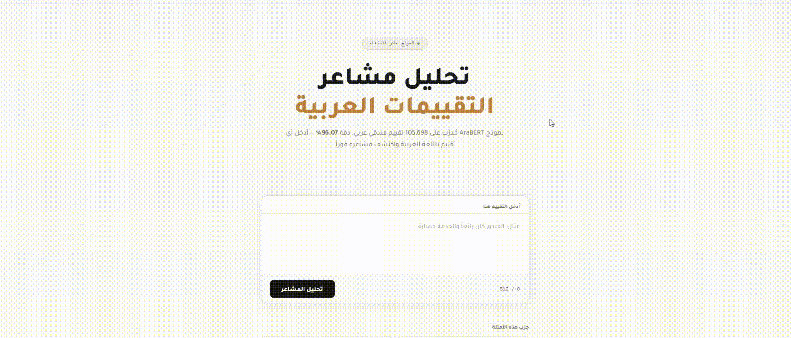

# AraReview - Arabic Sentiment Analysis


[](https://huggingface.co/dralsarrani/arareview)
[](https://huggingface.co/datasets/dralsarrani/AraReview)
[](https://python.org)

Fine-tuned AraBERT model for Arabic sentiment analysis, trained on 105K hotel reviews. Achieves **96.07% accuracy** and **0.96 F1-score**, outperforming a TF-IDF + Logistic Regression baseline by **+5.56%**.

**Live Demo → [](https://dralsarrani.github.io/AraReview/)**


---

## 📊 Results

| Model | Accuracy | F1 Score | Precision | Recall |
|---|---|---|---|---|
| **AraBERT (fine-tuned)** | **96.07%** | **0.9607** | **0.9609** | **0.9607** |
| TF-IDF + Logistic Regression | 90.51% | 0.9051 | — | — |

AraBERT outperforms the baseline by **+5.56% accuracy** on the test set of 10,547 reviews.

### Error Analysis
| Metric | Value |
|---|---|
| Total test samples | 10,547 |
| Correct predictions | 10,132 (96.1%) |
| Total errors | 415 (3.9%) |
| False positives | 268 |
| False negatives | 147 |
| Low confidence errors (<75%) | 40 |

---

## 🏗️ Architecture

```
Raw Arabic Reviews (105K)
           │
           ▼
┌─────────────────────────────────────────┐
│   Data Pipeline                         │
│   · Remove diacritics (tashkeel)        │
│   · Normalize Alef/Yeh/Teh variants     │
│   · Strip English characters & URLs     │
│   · Balance classes (52,849 each)       │
└─────────────────────────────────────────┘
           │
           ▼
┌─────────────────────────────────────────┐
│   Fine-tuning                           │
│   AraBERT (aubmindlab/bert-base-arabertv2) │
│   · 2 epochs · batch size 16 · fp16    │
│   · Learning rate 2e-5 · early stopping │
└─────────────────────────────────────────┘
           │
           ▼
┌─────────────────────────────────────────┐
│   Evaluation Framework                  │
│   · Baseline comparison (TF-IDF + LR)  │
│   · Confusion matrix                    │
│   · Confidence distribution analysis   │
│   · Error analysis (FP / FN)           │
└─────────────────────────────────────────┘
           │
           ▼
┌─────────────────────────────────────────┐
│   Deployment                            │
│   · FastAPI REST API                    │
│   · Arabic web interface (GitHub Pages) │
│   · Model on HuggingFace Hub            │
└─────────────────────────────────────────┘
```

---

## 🧠 Model Details

| Property | Value |
|---|---|
| Base model | `aubmindlab/bert-base-arabertv2` |
| Task | Binary sentiment classification |
| Labels | `positive` / `negative` |
| Training data | 84,372 reviews |
| Validation data | 10,547 reviews |
| Test data | 10,547 reviews |
| Max sequence length | 128 tokens |
| Training hardware | NVIDIA RTX 4060 |

---

## 📁 Project Structure

```
AraReview/
├── main.py               # FastAPI REST API backend
├── index.html            # Arabic web interface
├── Dockerfile            # Container for HuggingFace Spaces deployment
├── requirements.txt      # Dependencies
└── notebooks/
    └── evaluate.ipynb    # Full evaluation notebook with visualizations
    └── train.ipynb       # AraBERT fine-tuning script
    └── data.ipynb        # Arabic text cleaning & dataset preparation
```

---

## 🚀 Run Locally

```bash
# Clone the repo
git clone https://github.com/dralsarrani/AraReview
cd AraReview

# Install dependencies
pip install -r requirements.txt

# Step 1 — Build the dataset
python data.py

# Step 2 — Fine-tune AraBERT (requires GPU)
python train.py

# Step 3 — Evaluate
python evaluate.py

# Step 4 — Run the API
uvicorn main:app --reload
```

---

## 🔌 API Usage

The REST API is deployed on HuggingFace Spaces.

### Single prediction

```python
import requests

response = requests.post(
    "https://dralsarrani-arareviews-api.hf.space/predict",
    json={"text": "الفندق رائع والخدمة ممتازة"}
)
print(response.json())
# {
#   "text": "الفندق رائع والخدمة ممتازة",
#   "label": "positive",
#   "confidence": 0.9987,
#   "emoji": "✅ إيجابي"
# }
```

### Batch prediction (up to 50 reviews)

```python
response = requests.post(
    "https://dralsarrani-arareviews-api.hf.space/predict/batch",
    json=[
        {"text": "الفندق رائع والخدمة ممتازة"},
        {"text": "اسوا تجربة في حياتي"}
    ]
)
print(response.json())
```

---

## 🗺️ Roadmap

- [ ] Extend to 3-class sentiment (positive / neutral / negative)
- [ ] Add support for dialect Arabic (Gulf, Egyptian, Levantine)
- [ ] Fine-tune on product reviews (not just hotel reviews)
- [ ] Add explainability highlight which words drove the sentiment
- [ ] Multilingual support Arabic + English mixed reviews

---

## 📊 Dataset

The model was trained on the **HARD dataset** (Hotel Arabic Reviews Dataset) — 105,698 Arabic hotel reviews labeled by star rating, converted to binary sentiment labels.

- **Positive**: 4-5 star reviews (52,849)
- **Negative**: 1-2 star reviews (52,849)
- **Published at**: [huggingface.co/datasets/dralsarrani/AraReview](https://huggingface.co/datasets/dralsarrani/AraReview)

---

## 👤 Author

**Danah Al-Sarrani** — AI Engineer

[](https://github.com/dralsarrani)
[](https://huggingface.co/dralsarrani)
[](https://dralsarrani.github.io)
